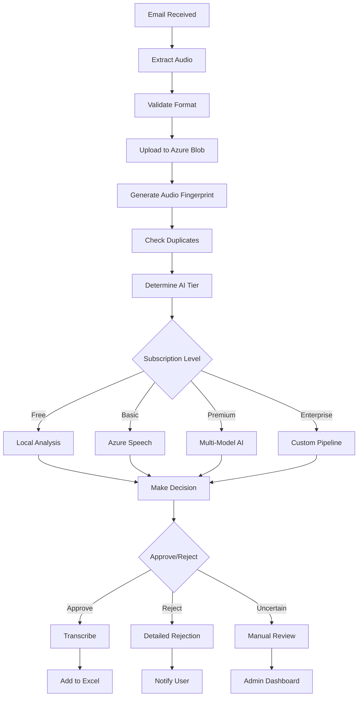

# 🎤 Sonexa AI - Voice Transcription SaaS Platform

[](https://opensource.org/licenses/MIT)
[](https://spring.io/projects/spring-boot)
[](https://openjdk.org/)
[](https://www.docker.com/)

> **Intelligent voice message transcription platform with AI-powered processing, subscription tiers, and email integration**

---

## 🚀 Quick Start

```bash
# 1. Clone the repository
git clone https://github.com/yourusername/sonexa-ai.git
cd sonexa-ai

# 2. Set up development environment
./dev.bat

# 3. Access the application
http://localhost:8080
```

---

## 📋 Table of Contents

- [Overview](#-overview)
- [Features](#-features)
- [Architecture](#-architecture)
- [Getting Started](#-getting-started)
- [API Documentation](#-api-documentation)
- [Database Schema](#-database-schema)
- [Subscription Tiers](#-subscription-tiers)
- [AI Processing Pipeline](#-ai-processing-pipeline)
- [Development Workflow](#-development-workflow)
- [Deployment](#-deployment)
- [Contributing](#-contributing)

---

## 🎯 Overview

Sonexa AI is a comprehensive voice transcription SaaS platform that allows users to send voice messages via email and receive accurate transcriptions through advanced AI processing. The platform features subscription-based pricing, intelligent spam detection, and a complete audit trail for all voice messages.

### 🎪 Live Demo

- **Demo URL**: `https://demo.sonexa.ai` (Coming Soon)
- **Admin Dashboard**: `https://admin.sonexa.ai` (Coming Soon)

### 🔑 Key Differentiators

- **Email-based ingestion**: Send voice messages to custom email addresses
- **Tiered AI processing**: Different AI models based on subscription level
- **Complete audit trail**: Every message tracked, nothing deleted
- **Smart duplicate detection**: Audio fingerprinting prevents spam
- **Cost-optimized**: Uses free GitHub Student Pack resources efficiently

---

## ✨ Features

### 🎵 Voice Processing

- [x] **Email-based voice message ingestion**
- [x] **Multi-format audio support** (MP3, WAV, M4A, OGG)
- [x] **Azure Blob Storage integration**
- [x] **Audio quality validation**
- [x] **Duplicate detection via audio fingerprinting**
- [ ] **Real-time processing notifications**
- [ ] **Batch processing for enterprise users**

### 🤖 AI & Intelligence

- [x] **Multi-tier AI processing**
  - Free: Basic local analysis
  - Premium: Azure Speech + OpenAI GPT-4
  - Enterprise: Custom AI pipelines
- [x] **Intelligent spam detection**
- [x] **Content safety filtering**
- [x] **Confidence scoring**
- [x] **Language detection**
- [ ] **Sentiment analysis**
- [ ] **Speaker identification**

### 💳 Subscription & Billing

- [x] **Stripe payment integration**
- [x] **Multiple subscription tiers**
  - 🆓 Free: 5 messages/month
  - 💼 Basic: 100 messages/month ($19.99)
  - ⭐ Premium: 1000 messages/month ($79.99)
  - 🏢 Enterprise: Unlimited ($299.99)
- [x] **Usage tracking and limits**
- [x] **Cost optimization**
- [ ] **Invoice generation**
- [ ] **Usage analytics dashboard**

### 🛡️ Security & Compliance

- [x] **JWT-based authentication**
- [x] **Role-based access control (RBAC)**
- [x] **Rate limiting and DDoS protection**
- [x] **Input validation and sanitization**
- [x] **Comprehensive audit logging**
- [ ] **GDPR compliance tools**
- [ ] **SOC 2 Type II certification**

### 📊 Analytics & Monitoring

- [x] **Processing success/failure rates**
- [x] **Cost tracking per user**
- [x] **Rejection reason analytics**
- [x] **Performance monitoring**
- [ ] **Business intelligence dashboard**
- [ ] **Custom reporting**

---

## 🏗️ Architecture

### 🖥️ System Overview

```
┌─────────────┐    ┌─────────────┐    ┌─────────────┐
│   Email     │───▶│  Sonexa AI  │───▶│   Excel     │
│  Gateway    │    │  Platform   │    │  Export     │
└─────────────┘    └─────────────┘    └─────────────┘
       │                   │                   │
       ▼                   ▼                   ▼
┌─────────────┐    ┌─────────────┐    ┌─────────────┐
│   Gmail     │    │  Azure AI   │    │ User Portal │
│ Integration │    │ Processing  │    │ Dashboard   │
└─────────────┘    └─────────────┘    └─────────────┘
```

### 🔧 Technology Stack

**Backend**

- **Framework**: Spring Boot 3.2.0
- **Language**: Java 21
- **Database**: PostgreSQL 15
- **Authentication**: JWT + Spring Security
- **API Documentation**: OpenAPI 3.0 (Swagger)

**AI & Processing**

- **Speech-to-Text**: Azure Speech Services
- **Advanced AI**: OpenAI GPT-4
- **Content Moderation**: Azure Content Moderator
- **Storage**: Azure Blob Storage

**DevOps & Infrastructure**

- **Containerization**: Docker + Docker Compose
- **CI/CD**: GitHub Actions
- **Monitoring**: Spring Boot Actuator
- **Logging**: SLF4J + Logback

**Payment & Billing**

- **Payment Processing**: Stripe
- **Subscription Management**: Custom implementation
- **Invoice Generation**: Stripe Billing

---

## 🚀 Getting Started

### 📋 Prerequisites

- **Java 21+** ([Download](https://openjdk.org/))
- **Docker & Docker Compose** ([Download](https://www.docker.com/))
- **Git** ([Download](https://git-scm.com/))
- **GitHub Student Pack** (for free AI credits)

### 🛠️ Local Development Setup

1. **Clone and Setup**

   ```bash
   git clone https://github.com/yourusername/sonexa-ai.git
   cd sonexa-ai
   git checkout develop
   ```

2. **Environment Configuration**

   ```bash
   # Copy environment template
   cp backend/src/main/resources/application-dev.properties.template backend/src/main/resources/application-dev.properties

   # Edit with your configuration
   notepad backend/src/main/resources/application-dev.properties
   ```

3. **Start Development Environment**

   ```bash
   # Windows
   ./dev.bat

   # This starts:
   # - PostgreSQL database (port 5432)
   # - Spring Boot application (port 8080)
   # - Redis for rate limiting (port 6379)
   ```

4. **Verify Installation**

   ```bash
   # Health check
   curl http://localhost:8080/actuator/health

   # API documentation
   http://localhost:8080/swagger-ui.html
   ```

### 🔑 Required Environment Variables

```bash
# Database
SPRING_DATASOURCE_URL=jdbc:postgresql://localhost:5432/sonexa_ai
SPRING_DATASOURCE_USERNAME=sonexa_user
SPRING_DATASOURCE_PASSWORD=your_password

# Azure Services (from GitHub Student Pack)
AZURE_SPEECH_SUBSCRIPTION_KEY=your_azure_speech_key
AZURE_SPEECH_REGION=your_region
AZURE_STORAGE_CONNECTION_STRING=your_azure_storage_connection

# Stripe (for payments)
STRIPE_SECRET_KEY=sk_test_your_stripe_secret_key
STRIPE_WEBHOOK_SECRET=whsec_your_webhook_secret

# OpenAI (for advanced AI features)
OPENAI_API_KEY=sk-your_openai_api_key

# JWT Security
JWT_SECRET=your_jwt_secret_key_here
JWT_EXPIRATION=86400000

# Email Configuration
SPRING_MAIL_HOST=smtp.gmail.com
SPRING_MAIL_USERNAME=your_email@gmail.com
SPRING_MAIL_PASSWORD=your_app_password
```

---

## 📚 API Documentation

### 🔐 Authentication Endpoints

| Method | Endpoint             | Description       |
| ------ | -------------------- | ----------------- |
| `POST` | `/api/auth/register` | Register new user |
| `POST` | `/api/auth/login`    | User login        |
| `POST` | `/api/auth/refresh`  | Refresh JWT token |

### 🎵 Voice Processing Endpoints

| Method   | Endpoint                  | Description                 |
| -------- | ------------------------- | --------------------------- |
| `POST`   | `/api/voice/email-upload` | Process email voice message |
| `GET`    | `/api/voice/user/{email}` | Get user's voice files      |
| `GET`    | `/api/voice/{id}`         | Get specific voice file     |
| `DELETE` | `/api/voice/{id}`         | Delete voice file           |

### 💳 Subscription Endpoints

| Method | Endpoint                          | Description                      |
| ------ | --------------------------------- | -------------------------------- |
| `GET`  | `/api/subscription/tiers`         | Get available subscription tiers |
| `POST` | `/api/subscription/create`        | Create new subscription          |
| `GET`  | `/api/subscription/usage/{email}` | Get user's current usage         |
| `POST` | `/api/stripe/webhook`             | Stripe webhook handler           |

### 📊 Analytics Endpoints

| Method | Endpoint                    | Description               |
| ------ | --------------------------- | ------------------------- |
| `GET`  | `/api/analytics/stats`      | Get processing statistics |
| `GET`  | `/api/analytics/costs`      | Get cost breakdown        |
| `GET`  | `/api/analytics/rejections` | Get rejection reasons     |

### 📖 Example API Usage

**Register a new user:**

```bash
curl -X POST http://localhost:8080/api/auth/register \
  -H "Content-Type: application/json" \
  -d '{
    "username": "johndoe",
    "email": "john@company.com",
    "password": "securePassword123"
  }'
```

**Process email voice message:**

```bash
curl -X POST http://localhost:8080/api/voice/email-upload \
  -H "Content-Type: application/json" \
  -H "Authorization: Bearer your_jwt_token" \
  -d '{
    "to": "john@voice.sonexa.ai",
    "from": "customer@company.com",
    "subject": "Voice message",
    "body": "Please transcribe this message",
    "attachments": [{
      "filename": "voice.mp3",
      "contentType": "audio/mpeg",
      "content": "base64_encoded_audio_data",
      "size": 2048576
    }]
  }'
```

---

## 🗄️ Database Schema

### 📊 Core Entities

#### Users Table

```sql
CREATE TABLE users (
    id UUID PRIMARY KEY,
    username VARCHAR(50) UNIQUE NOT NULL,
    email VARCHAR(100) UNIQUE NOT NULL,
    password_hash VARCHAR(255) NOT NULL,
    custom_voice_email VARCHAR(100) UNIQUE,
    created_at TIMESTAMP DEFAULT CURRENT_TIMESTAMP,
    updated_at TIMESTAMP DEFAULT CURRENT_TIMESTAMP
);
```

#### Voice Files Table

```sql
CREATE TABLE voice_files (
    id UUID PRIMARY KEY,
    original_filename VARCHAR(255) NOT NULL,
    content_type VARCHAR(100) NOT NULL,
    file_size BIGINT NOT NULL,
    azure_blob_url VARCHAR(500) NOT NULL,
    user_email VARCHAR(100) NOT NULL,
    sender_email VARCHAR(100),
    email_subject VARCHAR(255),
    email_body TEXT,
    upload_source VARCHAR(50) NOT NULL,
    transcription_status VARCHAR(50) NOT NULL,
    transcription_text TEXT,
    ai_confidence_score DECIMAL(3,2),
    ai_analysis_details TEXT,
    audio_fingerprint VARCHAR(64),
    user_subscription_tier VARCHAR(20),
    processing_cost DECIMAL(10,4),
    uploaded_at TIMESTAMP DEFAULT CURRENT_TIMESTAMP,
    processed_at TIMESTAMP,
    transcribed_at TIMESTAMP
);
```

#### User Subscriptions Table

```sql
CREATE TABLE user_subscriptions (
    id UUID PRIMARY KEY,
    user_email VARCHAR(100) NOT NULL,
    tier VARCHAR(20) NOT NULL,
    stripe_customer_id VARCHAR(100),
    stripe_subscription_id VARCHAR(100),
    status VARCHAR(20) NOT NULL,
    current_month_usage INTEGER DEFAULT 0,
    subscription_start_date TIMESTAMP,
    next_billing_date TIMESTAMP,
    created_at TIMESTAMP DEFAULT CURRENT_TIMESTAMP
);
```

### 🔍 Key Indexes

```sql
-- Performance indexes
CREATE INDEX idx_voice_files_user_email ON voice_files(user_email);
CREATE INDEX idx_voice_files_status ON voice_files(transcription_status);
CREATE INDEX idx_voice_files_uploaded_at ON voice_files(uploaded_at);
CREATE INDEX idx_voice_files_fingerprint ON voice_files(audio_fingerprint);
CREATE INDEX idx_subscriptions_user_email ON user_subscriptions(user_email);
```

---

## 💎 Subscription Tiers

| Feature                   | Free        | Basic             | Premium           | Enterprise          |
| ------------------------- | ----------- | ----------------- | ----------------- | ------------------- |
| **Monthly Messages**      | 5           | 100               | 1,000             | Unlimited           |
| **Price**                 | $0          | $19.99            | $79.99            | $299.99             |
| **AI Processing**         | Basic Local | Azure Speech      | Multi-Model AI    | Custom Pipeline     |
| **Processing Speed**      | Standard    | Standard          | Priority Queue    | Dedicated Resources |
| **Audio Quality**         | Standard    | Enhanced          | High Fidelity     | Studio Quality      |
| **Duplicate Detection**   | File Hash   | Basic Fingerprint | Semantic Analysis | Advanced ML         |
| **Custom Email Domain**   | ❌          | ❌                | ✅                | ✅                  |
| **API Access**            | ❌          | ❌                | ❌                | ✅                  |
| **Business Intelligence** | ❌          | ❌                | ✅                | ✅                  |
| **Support**               | Community   | Email             | Priority Email    | Dedicated Manager   |
| **SLA**                   | None        | 99%               | 99.5%             | 99.9%               |

### 💰 Cost Optimization Strategy

**Free Tier (GitHub Student Pack)**

- Local audio analysis: $0
- Azure Speech (5 hours/month): $0
- Basic duplicate detection: $0
- **Total Cost**: $0

**Premium Tier Cost Analysis**

- Azure Speech Services: ~$0.008/message
- OpenAI GPT-4: ~$0.02/message (20% of messages)
- Advanced processing: ~$0.005/message
- **Average Cost**: ~$0.015/message
- **Revenue**: $79.99/1000 = $0.08/message
- **Profit Margin**: 81%

---

## 🤖 AI Processing Pipeline

### 🔄 Processing Flow



### 🎯 AI Decision Matrix

| Criteria                | Weight | Free Tier        | Premium Tier          |
| ----------------------- | ------ | ---------------- | --------------------- |
| **Speech Quality**      | 30%    | Basic threshold  | Advanced analysis     |
| **Content Safety**      | 25%    | Keyword filter   | AI content moderation |
| **Duplicate Detection** | 20%    | File hash        | Semantic similarity   |
| **Spam Detection**      | 15%    | Pattern matching | ML classification     |
| **Language Detection**  | 10%    | Basic rules      | Multi-language AI     |

### 📊 Confidence Scoring

```java
// Example confidence calculation
double finalConfidence =
    (speechQuality * 0.3) +
    (contentSafety * 0.25) +
    (duplicateScore * 0.2) +
    (spamScore * 0.15) +
    (languageConfidence * 0.1);

if (finalConfidence > 0.8) {
    status = APPROVED;
} else if (finalConfidence < 0.3) {
    status = REJECTED;
} else {
    status = QUARANTINED_FOR_REVIEW;
}
```

---

## 🔄 Development Workflow

### 🌳 Git Branching Strategy

We use **GitFlow** with automated scripts for professional development:

```
main (production)
├── develop (integration)
│   ├── feature/stripe-integration
│   ├── feature/ai-processing
│   ├── feature/user-dashboard
│   └── feature/email-processing
├── hotfix/critical-fixes
└── release/v1.0.0
```

### 🚀 Quick Commands

```bash
# Setup branches (run once)
./git-setup.bat

# Commit current work
./git-commit-initial.bat

# Daily development
git checkout feature/your-feature
# ... make changes ...
./git-merge-feature.bat

# Production release
./git-release.bat
```

### 📝 Commit Standards

We follow [Conventional Commits](https://www.conventionalcommits.org/):

```bash
feat(auth): add JWT refresh token mechanism
fix(email): resolve attachment timeout issue
docs(api): update endpoint documentation
test(voice): add integration tests for processing
chore(deps): update Spring Boot to 3.2.0
```

---

## 🚢 Deployment

### 🐳 Docker Deployment

**Development:**

```bash
docker-compose -f docker-compose.dev.yml up
```

**Production:**

```bash
docker-compose -f docker-compose.prod.yml up -d
```

### ☁️ Cloud Deployment

**Azure Container Instances:**

```bash
# Build and push
docker build -t sonexa-ai:latest .
docker tag sonexa-ai:latest youracr.azurecr.io/sonexa-ai:latest
docker push youracr.azurecr.io/sonexa-ai:latest

# Deploy
az container create \
  --resource-group sonexa-ai-rg \
  --name sonexa-ai-app \
  --image youracr.azurecr.io/sonexa-ai:latest \
  --dns-name-label sonexa-ai \
  --ports 8080
```

**AWS ECS:**

```bash
# Using AWS CLI
aws ecs create-service \
  --cluster sonexa-ai-cluster \
  --service-name sonexa-ai-service \
  --task-definition sonexa-ai:1 \
  --desired-count 2
```

### 📊 Monitoring & Health Checks

**Health Endpoints:**

- Application: `http://localhost:8080/actuator/health`
- Database: `http://localhost:8080/actuator/health/db`
- Disk Space: `http://localhost:8080/actuator/health/diskSpace`

**Metrics:**

- Prometheus: `http://localhost:8080/actuator/prometheus`
- Application Metrics: `http://localhost:8080/actuator/metrics`

---

## 📈 Roadmap

### 🎯 Current Version (v1.0)

- [x] Core voice processing pipeline
- [x] Email integration
- [x] Basic AI analysis
- [x] User authentication
- [x] Subscription tiers
- [x] Stripe integration

### 🚀 Next Release (v1.1)

- [ ] Frontend React dashboard
- [ ] Real-time processing notifications
- [ ] Advanced AI with OpenAI
- [ ] Business intelligence analytics
- [ ] Mobile app for voice uploads

### 🌟 Future Versions (v2.0+)

- [ ] Multi-language support
- [ ] Speaker identification
- [ ] Voice emotion analysis
- [ ] Integration marketplace (Slack, Teams, etc.)
- [ ] White-label solutions
- [ ] Enterprise SSO integration

---

## 🤝 Contributing

We welcome contributions! Please see our [Contributing Guidelines](CONTRIBUTING.md) for details.

### 🚀 Quick Start for Contributors

1. **Fork the repository**
2. **Create a feature branch**: `git checkout -b feature/amazing-feature`
3. **Make your changes** following our coding standards
4. **Add tests** for new functionality
5. **Run the test suite**: `mvn test`
6. **Commit your changes**: `git commit -m 'feat: add amazing feature'`
7. **Push to your fork**: `git push origin feature/amazing-feature`
8. **Create a Pull Request**

### 📋 Development Guidelines

- **Code Style**: Follow Google Java Style Guide
- **Testing**: Minimum 80% test coverage required
- **Documentation**: Update README.md for any new features
- **Security**: All inputs must be validated and sanitized
- **Performance**: Consider cost implications of AI usage

---

## 📄 License

This project is licensed under the MIT License - see the [LICENSE](LICENSE) file for details.

---

## 👥 Team

- **Lead Developer**: [Your Name](https://github.com/yourusername)
- **AI Specialist**: [Team Member](https://github.com/teammate)
- **DevOps Engineer**: [Team Member](https://github.com/teammate)

---

## 📞 Support

- **Documentation**: [Wiki](https://github.com/yourusername/sonexa-ai/wiki)
- **Issues**: [GitHub Issues](https://github.com/yourusername/sonexa-ai/issues)
- **Discussions**: [GitHub Discussions](https://github.com/yourusername/sonexa-ai/discussions)
- **Email**: support@sonexa.ai
- **Discord**: [Join our community](https://discord.gg/sonexa-ai)

---

## 🏆 Acknowledgments

- **GitHub Student Pack** for free Azure credits
- **OpenAI** for advanced AI capabilities
- **Stripe** for payment processing
- **Spring Boot** for the robust framework
- **Azure** for cloud infrastructure

---

<div align="center">

**Built with ❤️ for developers who love clean code and professional workflows**

[⭐ Star this repo](https://github.com/yourusername/sonexa-ai) | [🐛 Report Bug](https://github.com/yourusername/sonexa-ai/issues) | [💡 Request Feature](https://github.com/yourusername/sonexa-ai/issues)

</div>
