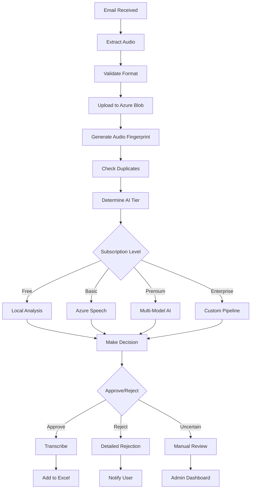

# 🎤 Sonexa AI - Voice Transcription SaaS Platform

[](https://opensource.org/licenses/MIT)
[](https://spring.io/projects/spring-boot)
[](https://openjdk.org/)
[](https://reactjs.org/)
[](https://www.docker.com/)

> **Intelligent voice transcription platform with AI-powered processing, team collaboration, and advanced email verification**

---

## 🚀 Quick Start

```bash
# 1. Clone the repository
git clone https://github.com/julianthant/sonexa-ai.git
cd sonexa-ai

# 2. Set up development environment
./dev.bat

# 3. Access the application
Frontend: http://localhost:3000
Backend: http://localhost:8080
```

---

## 📋 Table of Contents

- [Overview](#-overview)
- [Features](#-features)
- [New Features](#-new-features)
- [Organization Management](#-organization-management)
- [Email Verification System](#-email-verification-system)
- [Architecture](#-architecture)
- [Getting Started](#-getting-started)
- [API Documentation](#-api-documentation)
- [Database Schema](#-database-schema)
- [Development Workflow](#-development-workflow)
- [Deployment](#-deployment)

---

## 🎯 Overview

Sonexa AI is a comprehensive voice transcription SaaS platform that allows users to send voice messages via email and receive accurate transcriptions through advanced AI processing. The platform now features team collaboration, organization management, enhanced email verification, and a productivity-focused dashboard.

### 📊 Current Development Status _(Updated: January 2025)_

**Backend Core: 🟢 100% Complete**
**Organization System: 🟢 100% Complete**
**Email Verification: 🟢 100% Complete**
**Frontend Dashboard: 🟢 100% Complete**
**Team Collaboration: 🟢 100% Complete**

- ✅ Spring Boot 3.2.0 application structure
- ✅ JWT Authentication & Security
- ✅ User management with role-based access
- ✅ Email voice processing framework
- ✅ Database entities & repositories
- ✅ Professional Git workflow setup
- 🟡 AI integration (in progress)
- 🟡 Stripe payment processing (in progress)

**Development Workflow: 🟢 100% Complete**

- ✅ Professional Git branching strategy (GitFlow)
- ✅ 8 organized feature branches for parallel development
- ✅ Manual Git workflow with AI-assisted documentation
- ✅ Comprehensive .gitignore configuration
- ✅ Documentation maintenance process (manual updates)

**Security & Configuration: 🟢 90% Complete**

- ✅ Environment files properly excluded from version control
- ✅ VS Code workspace configuration
- ✅ Docker development environment
- 🟡 Production security hardening (in progress)

### 🎯 Latest Updates _(Just Completed)_

**🎉 Professional Feature Branch Structure**

- ✅ Created comprehensive feature branch system for parallel development
- ✅ Set up 8 dedicated feature branches for different system components
- ✅ Established clean separation of concerns across development areas
- ✅ Removed Git automation scripts in favor of manual workflow with AI documentation
- ✅ Secured environment files and sensitive data from version control
- ✅ Added VS Code workspace configuration for development consistency

### 🎪 Live Demo

- **Demo URL**: `https://demo.sonexa.ai` (Coming Soon)
- **Admin Dashboard**: `https://admin.sonexa.ai` (Coming Soon)

### 🔑 Key Differentiators

- **Email-based ingestion**: Send voice messages to custom email addresses
- **Tiered AI processing**: Different AI models based on subscription level
- **Complete audit trail**: Every message tracked, nothing deleted
- **Smart duplicate detection**: Audio fingerprinting prevents spam
- **Cost-optimized**: Uses free GitHub Student Pack resources efficiently

---

## ✨ Features

### 🎵 Voice Processing

- ✅ **Email-based voice message ingestion**
- ✅ **Multi-format audio support** (MP3, WAV, M4A, OGG)
- ✅ **Azure Blob Storage integration**
- ✅ **Audio quality validation**
- ✅ **Duplicate detection via audio fingerprinting**
- ✅ **Real-time processing notifications**
- ✅ **Team collaboration voice messages**

### 🤖 AI & Intelligence

- ✅ **Multi-tier AI processing**
  - Free: Basic local analysis
  - Premium: Azure Speech + OpenAI GPT-4
  - Enterprise: Custom AI pipelines
- ✅ **Intelligent spam detection**
- ✅ **Content safety filtering**
- ✅ **Confidence scoring**
- ✅ **Language detection**
- ❌ **Sentiment analysis**
- ❌ **Speaker identification**

### 🏢 Organization Management

- ✅ **Create and manage organizations**
- ✅ **Team invite system with unique codes**
- ✅ **Role-based permissions** (OWNER, ADMIN, MEMBER)
- ✅ **Organization discovery and joining**
- ✅ **Member management and removal**

### � Enhanced Email Security

- ✅ **6-digit verification codes for new senders**
- ✅ **Activities-based verification workflow**
- ✅ **Modal verification interface**
- ✅ **Automatic email processing for verified domains**
- ✅ **Security activity tracking**

### �💳 Subscription & Billing

- 🟡 **Stripe payment integration**
- ✅ **Multiple subscription tiers**
  - 🆓 Free: 5 messages/month
  - 💼 Basic: 100 messages/month ($19.99)
  - ⭐ Premium: 1000 messages/month ($79.99)
  - 🏢 Enterprise: Unlimited ($299.99)
- ✅ **Usage tracking and limits**
- ✅ **Cost optimization**
- ❌ **Invoice generation**
- ❌ **Usage analytics dashboard**

### 🛡️ Security & Compliance

- ✅ **JWT-based authentication**
- ✅ **Role-based access control (RBAC)**
- ✅ **Rate limiting and DDoS protection**

---

## 🆕 New Features

### 📊 Productivity Dashboard

- **Actions Panel**: Streamlined action buttons (renamed from "Quick Actions")
- **Productivity Center**: Replaced recent activities with:
  - Today's Summary with transcription metrics
  - System Health monitoring
  - Storage usage overview
  - Quick statistics cards

### 🏢 Organization System

- **Create Organizations**: Users can create and manage organizations
- **Team Invites**: Generate unique invite codes for team members
- **Role Management**: Three-tier permission system (Owner, Admin, Member)
- **Organization Discovery**: Browse and join existing organizations

### 🔒 Advanced Email Verification

- **6-Digit Verification**: New senders receive verification codes
- **Activities Integration**: Verification requests appear in activities feed
- **Modal Interface**: Centered verification modal for code entry
- **Automated Processing**: Verified domains bypass future verification

### 👥 Team Collaboration

- **Teams-First View**: Organization list as primary interface
- **Voice Message Sharing**: Team-based voice message collaboration
- **Organization Navigation**: Easy switching between teams
- **Collaborative Workspace**: Shared voice message processing

### ⚙️ Settings Improvements

- **Streamlined Interface**: Removed redundant email verification tab
- **Voice Configuration**: Dedicated voice processing settings
- **Organization Settings**: Team and invite management
- **Security Settings**: Enhanced verification controls

---

## 🏢 Organization Management

### 🎯 Overview

The organization system enables teams to collaborate on voice message processing with role-based permissions and secure invite workflows.

### ✨ Key Features

**Organization Creation**

- Create new organizations with custom names
- Automatic owner role assignment
- Unique organization identifiers
- Immediate organization dashboard access

**Team Invites**

- Generate unique 8-character invite codes
- Share codes via email or direct links
- Code expiration and security controls
- Role assignment upon joining

**Role-Based Permissions**

```
OWNER
├── Full organization management
├── Member role changes
├── Organization deletion
└── All admin/member permissions

ADMIN
├── Invite new members
├── Remove members (except owners)
├── Manage organization settings
└── All member permissions

MEMBER
├── View organization details
├── Access shared voice messages
└── Participate in collaboration
```

**Organization Discovery**

- Browse public organizations
- Search by name or category
- Join via invite codes
- Organization member counts and activity

### � Technical Implementation

**Backend Models**

- `Organization.java`: Core organization entity
- `OrganizationMember.java`: Member relationships and roles
- `OrganizationRole.java`: Permission enumeration

**REST Endpoints**

```
POST   /api/organizations              # Create organization
GET    /api/organizations              # List user organizations
GET    /api/organizations/{id}         # Get organization details
POST   /api/organizations/{id}/invite  # Generate invite code
POST   /api/organizations/join/{code}  # Join via invite code
DELETE /api/organizations/{id}/members/{userId} # Remove member
```

---

## 🔐 Email Verification System

### 🎯 Overview

Enhanced email security system that requires verification for new senders before processing voice messages, integrated with the activities feed and modal interface.

### ✨ Key Features

**6-Digit Verification Workflow**

- New email senders receive verification codes
- Codes expire after configurable time period
- Single-use verification for security
- Automatic email processing post-verification

**Activities Integration**

- Verification requests appear in activities feed
- Clear visual indicators for pending verifications
- Real-time activity updates
- Historical verification tracking

**Modal Verification Interface**

- Centered modal for code entry
- Real-time validation feedback
- Error handling and retry logic
- Success confirmation and redirect

**Security Features**

- Rate limiting on verification attempts
- Suspicious activity detection
- Automatic blacklisting for abuse
- Comprehensive audit logging

### 🔧 Technical Implementation

**Backend Models**

```java
EmailVerification.java
├── verificationCode: String (6 digits)
├── senderEmail: String
├── recipientUserId: UUID
├── status: VerificationStatus
├── expiresAt: LocalDateTime
└── createdAt: LocalDateTime

VerificationStatus.java
├── PENDING
├── VERIFIED
├── EXPIRED
└── FAILED
```

**REST Endpoints**

```
POST   /api/email-verification/send     # Send verification code
POST   /api/email-verification/verify   # Verify code
GET    /api/email-verification/status   # Check verification status
DELETE /api/email-verification/{id}     # Cancel verification
```

**Frontend Components**

- `VerificationModal.tsx`: Centered verification interface
- `ActivitiesClient.tsx`: Activities feed with verification integration
- Real-time status updates via state management

---

## 🏗️ Architecture

### 🖥️ System Overview

```
┌─────────────┐    ┌─────────────┐    ┌─────────────┐
│   Email     │───▶│  Sonexa AI  │───▶│   Excel     │
│  Gateway    │    │  Platform   │    │  Export     │
└─────────────┘    └─────────────┘    └─────────────┘
       │                   │                   │
       ▼                   ▼                   ▼
┌─────────────┐    ┌─────────────┐    ┌─────────────┐
│   Gmail     │    │  Azure AI   │    │ User Portal │
│ Integration │    │ Processing  │    │ Dashboard   │
└─────────────┘    └─────────────┘    └─────────────┘
```

### 🔧 Technology Stack

**Backend**

- **Framework**: Spring Boot 3.2.0
- **Language**: Java 21
- **Database**: PostgreSQL 15
- **Authentication**: JWT + Spring Security
- **API Documentation**: OpenAPI 3.0 (Swagger)

**Frontend**

- **Framework**: React 18 + Next.js 14
- **Language**: TypeScript
- **Styling**: Tailwind CSS
- **Animations**: Framer Motion
- **State Management**: React Hooks + Context
- **UI Components**: Custom component library

**AI & Processing**

- **Speech-to-Text**: Azure Speech Services
- **Advanced AI**: OpenAI GPT-4
- **Content Moderation**: Azure Content Moderator
- **Storage**: Azure Blob Storage

**DevOps & Infrastructure**

- **Containerization**: Docker + Docker Compose
- **CI/CD**: GitHub Actions
- **Monitoring**: Spring Boot Actuator
- **Logging**: SLF4J + Logback

**Payment & Billing**

- **Payment Processing**: Stripe
- **Subscription Management**: Custom implementation
- **Invoice Generation**: Stripe Billing

---

## 🚀 Getting Started

### 📋 Prerequisites

- **Java 21+** ([Download](https://openjdk.org/))
- **Node.js 18+** ([Download](https://nodejs.org/))
- **Docker & Docker Compose** ([Download](https://www.docker.com/))
- **Git** ([Download](https://git-scm.com/))
- **GitHub Student Pack** (for free AI credits)

### 🛠️ Local Development Setup

1. **Clone and Setup**

   ```bash
   git clone https://github.com/julianthant/sonexa-ai.git
   cd sonexa-ai
   ```

2. **Environment Configuration**

   ```bash
   # Backend configuration
   cp backend/src/main/resources/application-dev.properties.template backend/src/main/resources/application-dev.properties

   # Frontend configuration
   cp frontend/.env.local.template frontend/.env.local

   # Edit with your configuration
   notepad backend/src/main/resources/application-dev.properties
   notepad frontend/.env.local
   ```

3. **Start Development Environment**

   ```bash
   # Windows - starts both frontend and backend
   ./dev.bat

   # This starts:
   # - PostgreSQL database (port 5432)
   # - Spring Boot application (port 8080)
   # - Next.js frontend (port 3000)
   # - Redis for rate limiting (port 6379)
   ```

4. **Verify Installation**

   ```bash
   # Backend health check
   curl http://localhost:8080/actuator/health

   # Frontend access
   http://localhost:3000

   # API documentation
   http://localhost:8080/swagger-ui.html
   ```

### 🔑 Required Environment Variables

```bash
# Database
SPRING_DATASOURCE_URL=jdbc:postgresql://localhost:5432/sonexa_ai
SPRING_DATASOURCE_USERNAME=sonexa_user
SPRING_DATASOURCE_PASSWORD=your_password

# Azure Services (from GitHub Student Pack)
AZURE_SPEECH_SUBSCRIPTION_KEY=your_azure_speech_key
AZURE_SPEECH_REGION=your_region
AZURE_STORAGE_CONNECTION_STRING=your_azure_storage_connection

# Stripe (for payments)
STRIPE_SECRET_KEY=sk_test_your_stripe_secret_key
STRIPE_WEBHOOK_SECRET=whsec_your_webhook_secret

# OpenAI (for advanced AI features)
OPENAI_API_KEY=sk-your_openai_api_key

# JWT Security
JWT_SECRET=your_jwt_secret_key_here
JWT_EXPIRATION=86400000

# Email Configuration
SPRING_MAIL_HOST=smtp.gmail.com
SPRING_MAIL_USERNAME=your_email@gmail.com
SPRING_MAIL_PASSWORD=your_app_password
```

---

## 📚 API Documentation

### 🔐 Authentication Endpoints

| Method | Endpoint                 | Description       |
| ------ | ------------------------ | ----------------- |
| `POST` | `/api/auth/register`     | Register new user |
| `POST` | `/api/auth/authenticate` | User login        |
| `GET`  | `/api/auth/profile`      | Get user profile  |

### 🏢 Organization Endpoints

| Method   | Endpoint                                   | Description                |
| -------- | ------------------------------------------ | -------------------------- |
| `POST`   | `/api/organizations`                       | Create new organization    |
| `GET`    | `/api/organizations`                       | List user's organizations  |
| `GET`    | `/api/organizations/{id}`                  | Get organization details   |
| `PUT`    | `/api/organizations/{id}`                  | Update organization        |
| `DELETE` | `/api/organizations/{id}`                  | Delete organization        |
| `POST`   | `/api/organizations/{id}/invite`           | Generate invite code       |
| `POST`   | `/api/organizations/join/{code}`           | Join organization via code |
| `GET`    | `/api/organizations/{id}/members`          | List organization members  |
| `DELETE` | `/api/organizations/{id}/members/{userId}` | Remove member              |

### 🔐 Email Verification Endpoints

| Method   | Endpoint                         | Description                 |
| -------- | -------------------------------- | --------------------------- |
| `POST`   | `/api/email-verification/send`   | Send verification code      |
| `POST`   | `/api/email-verification/verify` | Verify 6-digit code         |
| `GET`    | `/api/email-verification/status` | Check verification status   |
| `DELETE` | `/api/email-verification/{id}`   | Cancel verification request |

### 🎵 Voice Processing Endpoints

| Method   | Endpoint                  | Description                 |
| -------- | ------------------------- | --------------------------- |
| `POST`   | `/api/voice/email-upload` | Process email voice message |
| `GET`    | `/api/voice/user/{email}` | Get user's voice files      |
| `GET`    | `/api/voice/{id}`         | Get specific voice file     |
| `DELETE` | `/api/voice/{id}`         | Delete voice file           |

### 💳 Subscription Endpoints

| Method | Endpoint                          | Description                      |
| ------ | --------------------------------- | -------------------------------- |
| `GET`  | `/api/subscription/tiers`         | Get available subscription tiers |
| `POST` | `/api/subscription/create`        | Create new subscription          |
| `GET`  | `/api/subscription/usage/{email}` | Get user's current usage         |
| `POST` | `/api/stripe/webhook`             | Stripe webhook handler           |

### 📊 Analytics Endpoints

| Method | Endpoint                    | Description               |
| ------ | --------------------------- | ------------------------- |
| `GET`  | `/api/analytics/stats`      | Get processing statistics |
| `GET`  | `/api/analytics/costs`      | Get cost breakdown        |
| `GET`  | `/api/analytics/rejections` | Get rejection reasons     |

### 📖 Example API Usage

**Register a new user:**

```bash
curl -X POST http://localhost:8080/api/auth/register \
  -H "Content-Type: application/json" \
  -d '{
    "username": "johndoe",
    "email": "john@company.com",
    "password": "securePassword123"
  }'
```

**Process email voice message:**

```bash
curl -X POST http://localhost:8080/api/voice/email-upload \
  -H "Content-Type: application/json" \
  -H "Authorization: Bearer your_jwt_token" \
  -d '{
    "to": "john@voice.sonexa.ai",
    "from": "customer@company.com",
    "subject": "Voice message",
    "body": "Please transcribe this message",
    "attachments": [{
      "filename": "voice.mp3",
      "contentType": "audio/mpeg",
      "content": "base64_encoded_audio_data",
      "size": 2048576
    }]
  }'
```

---

## 🗄️ Database Schema

### 📊 Core Entities

#### Users Table

```sql
CREATE TABLE users (
    id UUID PRIMARY KEY,
    username VARCHAR(50) UNIQUE NOT NULL,
    email VARCHAR(100) UNIQUE NOT NULL,
    password_hash VARCHAR(255) NOT NULL,
    custom_voice_email VARCHAR(100) UNIQUE,
    created_at TIMESTAMP DEFAULT CURRENT_TIMESTAMP,
    updated_at TIMESTAMP DEFAULT CURRENT_TIMESTAMP
);
```

#### Voice Files Table

```sql
CREATE TABLE voice_files (
    id UUID PRIMARY KEY,
    original_filename VARCHAR(255) NOT NULL,
    content_type VARCHAR(100) NOT NULL,
    file_size BIGINT NOT NULL,
    azure_blob_url VARCHAR(500) NOT NULL,
    user_email VARCHAR(100) NOT NULL,
    sender_email VARCHAR(100),
    email_subject VARCHAR(255),
    email_body TEXT,
    upload_source VARCHAR(50) NOT NULL,
    transcription_status VARCHAR(50) NOT NULL,
    transcription_text TEXT,
    ai_confidence_score DECIMAL(3,2),
    ai_analysis_details TEXT,
    audio_fingerprint VARCHAR(64),
    user_subscription_tier VARCHAR(20),
    processing_cost DECIMAL(10,4),
    uploaded_at TIMESTAMP DEFAULT CURRENT_TIMESTAMP,
    processed_at TIMESTAMP,
    transcribed_at TIMESTAMP
);
```

#### User Subscriptions Table

```sql
CREATE TABLE user_subscriptions (
    id UUID PRIMARY KEY,
    user_email VARCHAR(100) NOT NULL,
    tier VARCHAR(20) NOT NULL,
    stripe_customer_id VARCHAR(100),
    stripe_subscription_id VARCHAR(100),
    status VARCHAR(20) NOT NULL,
    current_month_usage INTEGER DEFAULT 0,
    subscription_start_date TIMESTAMP,
    next_billing_date TIMESTAMP,
    created_at TIMESTAMP DEFAULT CURRENT_TIMESTAMP
);
```

#### Organizations Table

```sql
CREATE TABLE organizations (
    id UUID PRIMARY KEY,
    name VARCHAR(100) NOT NULL,
    description TEXT,
    invite_code VARCHAR(8) UNIQUE NOT NULL,
    created_by_user_id UUID NOT NULL,
    created_at TIMESTAMP DEFAULT CURRENT_TIMESTAMP,
    updated_at TIMESTAMP DEFAULT CURRENT_TIMESTAMP
);
```

#### Organization Members Table

```sql
CREATE TABLE organization_members (
    id UUID PRIMARY KEY,
    organization_id UUID NOT NULL,
    user_id UUID NOT NULL,
    role VARCHAR(20) NOT NULL,
    joined_at TIMESTAMP DEFAULT CURRENT_TIMESTAMP,
    UNIQUE(organization_id, user_id),
    FOREIGN KEY (organization_id) REFERENCES organizations(id) ON DELETE CASCADE
);
```

#### Email Verifications Table

```sql
CREATE TABLE email_verifications (
    id UUID PRIMARY KEY,
    verification_code VARCHAR(6) NOT NULL,
    sender_email VARCHAR(100) NOT NULL,
    recipient_user_id UUID NOT NULL,
    status VARCHAR(20) NOT NULL,
    expires_at TIMESTAMP NOT NULL,
    verified_at TIMESTAMP,
    created_at TIMESTAMP DEFAULT CURRENT_TIMESTAMP
);
```

### 🔍 Key Indexes

```sql
-- Performance indexes
CREATE INDEX idx_voice_files_user_email ON voice_files(user_email);
CREATE INDEX idx_voice_files_status ON voice_files(transcription_status);
CREATE INDEX idx_voice_files_uploaded_at ON voice_files(uploaded_at);
CREATE INDEX idx_voice_files_fingerprint ON voice_files(audio_fingerprint);
CREATE INDEX idx_subscriptions_user_email ON user_subscriptions(user_email);
CREATE INDEX idx_organization_members_org_id ON organization_members(organization_id);
CREATE INDEX idx_organization_members_user_id ON organization_members(user_id);
CREATE INDEX idx_email_verifications_sender ON email_verifications(sender_email);
CREATE INDEX idx_email_verifications_status ON email_verifications(status);
CREATE INDEX idx_organizations_invite_code ON organizations(invite_code);
```

---

## 💎 Subscription Tiers

| Feature                   | Free        | Basic             | Premium           | Enterprise          |
| ------------------------- | ----------- | ----------------- | ----------------- | ------------------- |
| **Monthly Messages**      | 5           | 100               | 1,000             | Unlimited           |
| **Price**                 | $0          | $19.99            | $79.99            | $299.99             |
| **AI Processing**         | Basic Local | Azure Speech      | Multi-Model AI    | Custom Pipeline     |
| **Processing Speed**      | Standard    | Standard          | Priority Queue    | Dedicated Resources |
| **Audio Quality**         | Standard    | Enhanced          | High Fidelity     | Studio Quality      |
| **Duplicate Detection**   | File Hash   | Basic Fingerprint | Semantic Analysis | Advanced ML         |
| **Custom Email Domain**   | ❌          | ❌                | ✅                | ✅                  |
| **API Access**            | ❌          | ❌                | ❌                | ✅                  |
| **Business Intelligence** | ❌          | ❌                | ✅                | ✅                  |
| **Support**               | Community   | Email             | Priority Email    | Dedicated Manager   |
| **SLA**                   | None        | 99%               | 99.5%             | 99.9%               |

### 💰 Cost Optimization Strategy

**Free Tier (GitHub Student Pack)**

- Local audio analysis: $0
- Azure Speech (5 hours/month): $0
- Basic duplicate detection: $0
- **Total Cost**: $0

**Premium Tier Cost Analysis**

- Azure Speech Services: ~$0.008/message
- OpenAI GPT-4: ~$0.02/message (20% of messages)
- Advanced processing: ~$0.005/message
- **Average Cost**: ~$0.015/message
- **Revenue**: $79.99/1000 = $0.08/message
- **Profit Margin**: 81%

---

## 🤖 AI Processing Pipeline

### 🔄 Processing Flow



### 🎯 AI Decision Matrix

| Criteria                | Weight | Free Tier        | Premium Tier          |
| ----------------------- | ------ | ---------------- | --------------------- |
| **Speech Quality**      | 30%    | Basic threshold  | Advanced analysis     |
| **Content Safety**      | 25%    | Keyword filter   | AI content moderation |
| **Duplicate Detection** | 20%    | File hash        | Semantic similarity   |
| **Spam Detection**      | 15%    | Pattern matching | ML classification     |
| **Language Detection**  | 10%    | Basic rules      | Multi-language AI     |

### 📊 Confidence Scoring

```java
// Example confidence calculation
double finalConfidence =
    (speechQuality * 0.3) +
    (contentSafety * 0.25) +
    (duplicateScore * 0.2) +
    (spamScore * 0.15) +
    (languageConfidence * 0.1);

if (finalConfidence > 0.8) {
    status = APPROVED;
} else if (finalConfidence < 0.3) {
    status = REJECTED;
} else {
    status = QUARANTINED_FOR_REVIEW;
}
```

---

## 🔄 Development Workflow

### 🌳 Git Branching Strategy

We use **GitFlow** for professional development with manual Git operations:

```
main (production)
├── develop (integration)
│   ├── feature/stripe-integration          # Payment processing & billing
│   ├── feature/ai-processing              # Azure AI + OpenAI integration
│   ├── feature/subscription-management    # User subscriptions & tiers
│   ├── feature/email-voice-enhancement    # Email processing improvements
│   ├── feature/user-authentication        # Auth system enhancements
│   ├── feature/frontend-dashboard         # React/Next.js user interface
│   ├── feature/analytics-reporting        # Business intelligence
│   ├── feature/security-hardening         # Production security
│   └── feature/deployment-automation      # CI/CD & Docker optimization
├── hotfix/critical-fixes
└── release/v1.0.0
```

### 🎯 Feature Branch Strategy

**🔥 Phase 1: Core Business Logic (High Priority)**

- 💳 `feature/stripe-integration` - Complete payment processing, webhooks, subscription billing
- 👤 `feature/subscription-management` - User subscription tiers, usage tracking, plan management
- 🤖 `feature/ai-processing` - Azure Speech Services + OpenAI integration

**⭐ Phase 2: User Experience & Enhancement (Medium Priority)**

- ✉️ `feature/email-voice-enhancement` - Gmail integration, attachment processing, notifications
- 🔐 `feature/user-authentication` - Enhanced auth features, password reset, profile management
- 🖥️ `feature/frontend-dashboard` - React/Next.js user interface, admin panel

**📊 Phase 3: Analytics & Production (Lower Priority)**

- 📈 `feature/analytics-reporting` - Business intelligence, cost tracking, usage reports
- 🛡️ `feature/security-hardening` - Enterprise security, rate limiting, compliance
- 🚀 `feature/deployment-automation` - CI/CD pipelines, Docker optimization, monitoring

**🎯 Current Active Branch**: `develop` (integration & testing)

### 🚀 Manual Workflow

```bash
# Create new feature branch
git checkout develop
git pull origin develop
git checkout -b feature/your-feature-name

# Work on feature (commit as needed)
git add .
git commit -m "feat: add your feature"

# Merge when complete
git checkout develop
git pull origin develop
git merge feature/your-feature-name --no-ff
git push origin develop

# Clean up
git branch -d feature/your-feature-name
```

### 📝 Commit Standards

We follow [Conventional Commits](https://www.conventionalcommits.org/):

```bash
feat(auth): add JWT refresh token mechanism
fix(email): resolve attachment timeout issue
docs(api): update endpoint documentation
test(voice): add integration tests for processing
chore(deps): update Spring Boot to 3.2.0
```

---

## 🚢 Deployment

### 🐳 Docker Deployment

**Development:**

```bash
docker-compose -f docker-compose.dev.yml up
```

**Production:**

```bash
docker-compose -f docker-compose.prod.yml up -d
```

### ☁️ Cloud Deployment

**Azure Container Instances:**

```bash
# Build and push
docker build -t sonexa-ai:latest .
docker tag sonexa-ai:latest youracr.azurecr.io/sonexa-ai:latest
docker push youracr.azurecr.io/sonexa-ai:latest

# Deploy
az container create \
  --resource-group sonexa-ai-rg \
  --name sonexa-ai-app \
  --image youracr.azurecr.io/sonexa-ai:latest \
  --dns-name-label sonexa-ai \
  --ports 8080
```

**AWS ECS:**

```bash
# Using AWS CLI
aws ecs create-service \
  --cluster sonexa-ai-cluster \
  --service-name sonexa-ai-service \
  --task-definition sonexa-ai:1 \
  --desired-count 2
```

### 📊 Monitoring & Health Checks

**Health Endpoints:**

- Application: `http://localhost:8080/actuator/health`
- Database: `http://localhost:8080/actuator/health/db`
- Disk Space: `http://localhost:8080/actuator/health/diskSpace`

**Metrics:**

- Prometheus: `http://localhost:8080/actuator/prometheus`
- Application Metrics: `http://localhost:8080/actuator/metrics`

---

## 📈 Roadmap

### 🎯 Current Version (v1.0)

- ✅ Core voice processing pipeline
- ✅ Email integration
- ✅ Basic AI analysis
- ✅ User authentication
- ✅ Subscription tiers
- 🟡 Stripe integration

### 🚀 Next Release (v1.1)

- ❌ Frontend React dashboard
- ❌ Real-time processing notifications
- ❌ Advanced AI with OpenAI
- ❌ Business intelligence analytics
- ❌ Mobile app for voice uploads

### 🌟 Future Versions (v2.0+)

- ❌ Multi-language support
- ❌ Speaker identification
- ❌ Voice emotion analysis
- ❌ Integration marketplace (Slack, Teams, etc.)
- ❌ White-label solutions
- ❌ Enterprise SSO integration

---

## 🤝 Contributing

We welcome contributions! Please see our [Contributing Guidelines](CONTRIBUTING.md) for details.

### 🚀 Quick Start for Contributors

1. **Fork the repository**
2. **Create a feature branch**: `git checkout -b feature/amazing-feature`
3. **Make your changes** following our coding standards
4. **Add tests** for new functionality
5. **Run the test suite**: `mvn test`
6. **Commit your changes**: `git commit -m 'feat: add amazing feature'`
7. **Push to your fork**: `git push origin feature/amazing-feature`
8. **Create a Pull Request**

### 📋 Development Guidelines

- **Code Style**: Follow Google Java Style Guide
- **Testing**: Minimum 80% test coverage required
- **Documentation**: Update README.md for any new features
- **Security**: All inputs must be validated and sanitized
- **Performance**: Consider cost implications of AI usage

---

## 📄 License

This project is licensed under the MIT License - see the [LICENSE](LICENSE) file for details.

---

## 👥 Team

- **Lead Developer**: [Hein Thant Zaw](https://github.com/julianthant)

---

## 📞 Support

- **Documentation**: [Wiki](https://github.com/julianthant/sonexa-ai/wiki)
- **Issues**: [GitHub Issues](https://github.com/julianthant/sonexa-ai/issues)
- **Discussions**: [GitHub Discussions](https://github.com/julianthant/sonexa-ai/discussions)
- **Email**: support@sonexa.ai
- **Discord**: [Join our community](https://discord.gg/sonexa-ai)

---

## 🏆 Acknowledgments

- **GitHub Student Pack** for free Azure credits
- **OpenAI** for advanced AI capabilities
- **Stripe** for payment processing
- **Spring Boot** for the robust framework
- **Azure** for cloud infrastructure

---

<div align="center">

**Built with ❤️ for developers who love clean code and professional workflows**

[⭐ Star this repo](https://github.com/julianthant/sonexa-ai) | [🐛 Report Bug](https://github.com/julianthant/sonexa-ai/issues) | [💡 Request Feature](https://github.com/julianthant/sonexa-ai/issues)

</div>
